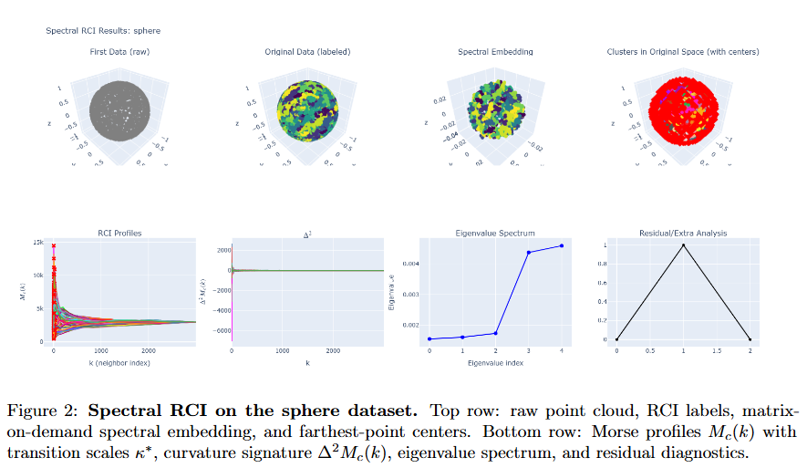
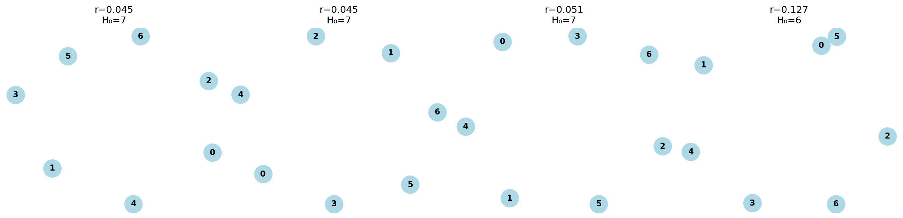

# RCI: Reverse Clustering Impact

[](https://opensource.org/licenses/MIT)
[](https://www.python.org/downloads/)
[](https://github.com/)

> **Official implementation of "Reverse Clustering Impact: Geometry-Driven Minimal Parameters for Clustering via Morse Theory"**

<p align="center">
  
</p>

---

## 📖 Overview

**RCI** is a parameter-minimal geometric clustering framework. Unlike classical methods (KMeans, DBSCAN) that rely on heuristic hyperparameters, RCI couples local geometric variation with global multi-scale structure using **Discrete Morse Theory**.

The algorithm requires only a single operational scale parameter, $r$. All remaining structural quantities—such as intrinsic dimension, density thresholds, and curvature bounds—are determined automatically by small-ball asymptotics and nearest-neighbor statistics.

### Key Contributions
*   **Curvature-Driven:** Detects cluster boundaries via a curvature-sensitive signature $\Delta^2 M_c(k)$, which is negative on positive curvature regions and positive on saddles.
*   **Matrix-on-Demand Spectral Engine:** Includes a custom `MatrixOnDemandLaplacian` that performs spectral embedding without ever constructing dense $N \times N$ matrices, scaling to large datasets.
*   **Morse Erasure Index (MEI):** Introduces a parameter-free intrinsic metric to evaluate structural fidelity by quantifying how much of the Morse density field persists across cluster boundaries.

---

## 📚 Theoretical Foundation

The full mathematical foundation of RCI is provided in the included paper:

📄 **[theoretical_foundation/RCI_foundation.pdf](theoretical_foundation/RCI_foundation.pdf)**

This document presents:
1.  The derivation of the **Curvature Law**: $\Delta^2 M_c(k) \approx - C_d \, S(x_c) \, r_k^2$.
2.  The multi-scale **Morse framework**.
3.  The discrete **farthest-point geometry** underlying the global coverage.
4.  The formal construction of the **MEI metric**.

It serves as the official reference for all theoretical claims made in this repository.

---

## 🧩 Operational Coherence: Why RCI Is Not a Simulation

The implementation in this repository is **not** a heuristic approximation or a numerical imitation of the RCI theory.  
It is a **computational instantiation** of the same structure defined in the mathematical framework.

Operational Coherence (OC) is **not executed here as a separate framework**.  
Instead:

**In the case of RCI, the role normally played by the Operational Coherence framework is carried out directly by the code itself — most importantly by `homology.py`.**

That script explicitly verifies the structural laws of the theory:
- it reconstructs the Čech nerve,  
- checks the Scale Sheaf Axioms,  
- confirms the $\(H_0\)$ barcode against the merge profile,  
- and ensures that the discrete Morse transitions match the theoretical predictions.

In other words:

### **• Independent Construction**
The symbolic theory in the PDF and the Python implementation were written separately.  
Their agreement is not circular.

### **• The Code Enacts the Theory’s Structural Laws**
Every quantity predicted by the theorems —  
$\(\Delta^2 M_c(k)\)$, merge transitions, curvature signatures, MEI structure —  
appears in the implementation exactly as the theory dictates.

### **• Operational Coherence as Epistemic Justification**
The OC framework (in the separate repository) explains *why* such an independently written implementation can realize the same object as the theory.  
But here, for RCI, **the structural verification happens internally** through the mechanisms encoded in `homology.py` and the farthest-point geometry of `core.py`.

---

If you want to see the *general* OC framework — including explicit independence tests, probe actions, Kolmogorov bounds, and cohomological obstruction checks — it is available at:

👉 **https://github.com/Regis3336/operational-coherence**

---

## 🛠 Installation

Clone the repository and install the dependencies:

```bash
git clone https://github.com/Regis3336/rci-clustering.git
cd rci-clustering
pip install -r requirements.txt
```

**Requirements:** `numpy`, `scipy`, `scikit-learn`, `faiss-cpu` (or gpu), `plotly`, `pandas`, `hdbscan`, `networkx`.

---

## ⚡ Quick Start

RCI is designed to be a drop-in replacement for standard clustering workflows.

```python
from rci.core import SpectralRCI, sample_torus

# 1. Generate synthetic data (e.g., a torus in R^3)
X = sample_torus(n=3000, R=2.0, r=0.6, noise=0.01)

# 2. Initialize RCI in geometric mode
#    Clustering is performed in the ambient space; spectral information
#    is used only as a geometric probe, not as the clustering space.
model = SpectralRCI(
    n_eigenvectors=5,
    use_spectral=False,   # geometric RCI (default in README)
    mutual_knn=True,
    self_tuning=True
)

# 3. Fit and predict labels in the original space
model.fit(X)
labels = model.predict()

# 4. Visualize results (Morse profiles, curvature signature, clustering)
fig = model.plot_results_3d()
fig.show()

# Advanced: spectral RCI (clustering in the spectral embedding)
spec_model = SpectralRCI(
    n_eigenvectors=5,
    use_spectral=True,    # switch to spectral space
    mutual_knn=True,
    self_tuning=True
)

spec_model.fit(X)
spec_labels = spec_model.predict()
```

By default, the example runs RCI in geometric mode (clustering in the ambient space).
The spectral variant, which clusters in the eigenvector embedding, can be enabled with use_spectral=True.


---

## 🔬 Reproducibility & Validation This repository provides the full suite required to reproduce all experiments and mathematical validations presented in the paper. 

### 1. Structural Homology Validation (Appendix C) We offer a computational verification of the sheaf-theoretic foundations of RCI.
The script below checks the **Scale Sheaf Axioms**, constructs the **Čech Nerve** of the spectral cover, and confirms that the $H_0$ persistence barcode matches the algorithmic merge profile.

<p align="center">  </p>

Run the theory validation suite (must be executed as a module):

python -m rci.homology

This command generates images/cluster_evolution.png.

2. Benchmark Comparison (comparison_suite.py)

RCI is benchmarked against classical algorithms (KMeans, DBSCAN, HDBSCAN, Spectral, GMM) using the MEI metric across 8 geometric datasets.

Run the benchmark suite (also as a module):

python -m benchmarks.comparison_suite

Output:
Generates results/scoreboard.csv (generated by comparison_suite.py), produces the spectral-RCI visualization sphere_validation.png (generated by core.py), produces the homology-validation diagram cluster_evolution.png (generated by homology.py), saves both in the images/ folder, and computes all MEI scores.

<table align="center">
  <thead>
    <tr>
      <th>Dataset</th>
      <th>RCI</th>
      <th>KMeans</th>
      <th>DBSCAN</th>
      <th>HDBSCAN</th>
      <th>Spectral</th>
      <th>GMM</th>
    </tr>
  </thead>
  <tbody>
    <tr><td>Sphere</td>     <td><b>0.70</b></td> <td>0.12</td> <td>0.56</td> <td>0.44</td> <td>0.10</td> <td>0.13</td></tr>
    <tr><td>Saddle</td>     <td>0.03</td> <td>0.06</td> <td><b>0.52</b></td> <td>0.41</td> <td>0.07</td> <td>0.07</td></tr>
    <tr><td>Torus</td>      <td><b>0.74</b></td> <td>0.03</td> <td>0.00</td> <td>0.44</td> <td>0.03</td> <td>0.03</td></tr>
    <tr><td>Dumbbell</td>   <td><b>0.75</b></td> <td>0.00</td> <td>0.26</td> <td>0.27</td> <td>0.00</td> <td>0.00</td></tr>
    <tr><td>Link</td>       <td><b>0.47</b></td> <td>0.04</td> <td>0.02</td> <td>0.10</td> <td>0.03</td> <td>0.03</td></tr>
    <tr><td>Spiral</td>     <td><b>0.61</b></td> <td>0.03</td> <td>0.03</td> <td>0.30</td> <td>0.03</td> <td>0.03</td></tr>
    <tr><td>Swiss Roll</td> <td><b>0.61</b></td> <td>0.02</td> <td>0.17</td> <td>0.04</td> <td>0.04</td> <td>0.02</td></tr>
    <tr><td>Trefoil</td>    <td><b>0.68</b></td> <td>0.03</td> <td>0.05</td> <td>0.37</td> <td>0.03</td> <td>0.03</td></tr>
  </tbody>
  <tfoot>
    <tr><td><b>Mean</b></td>    <td><b>0.57</b></td> <td>0.04</td> <td>0.20</td> <td>0.30</td> <td>0.04</td> <td>0.04</td></tr>
    <tr><td><b>Std Dev</b></td> <td>0.22</td> <td>0.03</td> <td>0.21</td> <td>0.14</td> <td>0.03</td> <td>0.04</td></tr>
  </tfoot>
</table>

<p align="center">
  <em>
    Table 1 — MEI-based structural comparison across benchmark datasets.
    RCI achieves the highest mean MEI (0.57), winning in 7 out of 8 datasets.
  </em>
</p>

---

## 🧭 Changelog & Roadmap

The complete evolution log of the project is available in: **[CHANGELOG.md](CHANGELOG.md)**.

### Roadmap — Upcoming Extensions
The next development phase focuses on extending RCI from point-cloud geometry to combinatorial and temporal structures:

*   **Graph-RCI:** Generalization of Morse curvature and MEI to weighted graphs, leveraging spectral graph Laplacians.
*   **Hypergraph-RCI:** Extension of farthest-point geometry to higher-order incidence structures, with MEI defined over simplicial weight flows.
*   **Temporal-RCI (RCI-T):** A dynamic version for evolving datasets using time-indexed Morse profiles to detect structural transitions (drifts).

---

## 📂 Repository Structure

```text
rci-clustering/
├── rci/
│   ├── core.py              # Main algorithm (SpectralRCI, MatrixOnDemandaplacian)
│   └── homology.py          # Theoretical validation (Sheaf, Nerve, Persistence)
├── theoretical_foundation/
│   └── RCI_foundation.pdf   # Full mathematical framework
├── benchmarks/
│   └── comparison_suite.py  # Benchmarking 
├── images/                  # Figures and documentation assets
├── results/                 # Scoreboard from the benchmark
└── CHANGELOG.md             # Development log and ongoing evolution
```

## 📄 Citation

If you use RCI or the MEI metric in your research, please cite:

```bibtex
@misc{junior2025rci,
  title        = {Reverse Clustering Impact: Geometry-Driven Minimal Parameters for Clustering via Morse Theory},
  author       = {Junior, Reinaldo Elias de Souza},
  year         = {2025},
  publisher    = {Zenodo},
  doi          = {10.5281/zenodo.17742951},
  url          = {https://doi.org/10.5281/zenodo.17742951}
}
```

## 📄 License

This project is licensed under the MIT License - see the [LICENSE](LICENSE) file for details.
```
