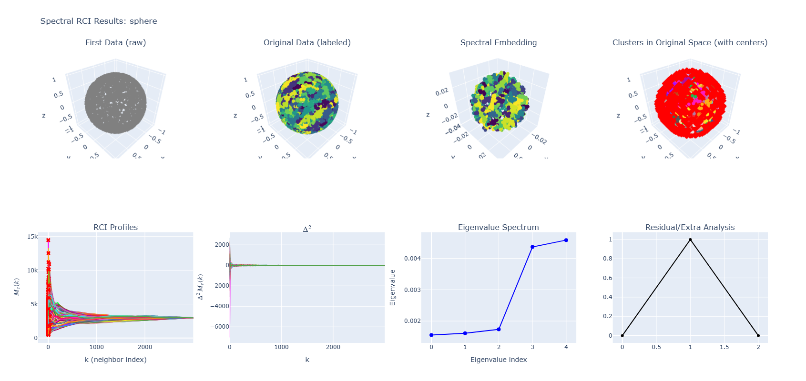
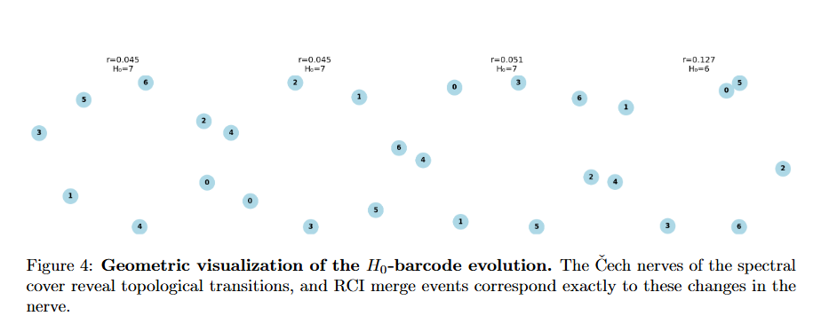

# rci-clustering
RCI is a geometry-driven clustering method that detects structure using Morse profiles, local curvature, and a matrix-on-demand Laplacian. It runs with a single scale parameter, auto-adapts density and intrinsic dimension, and identifies clusters as regions where geometric structure resists morphological erasure.

# RCI: Reverse Clustering Impact

[](https://opensource.org/licenses/MIT)
[](https://www.python.org/downloads/)
[](https://github.com/)

> **Official implementation of "Reverse Clustering Impact: Geometry-Driven Minimal Parameters for Clustering via Morse Theory"**


---

## 📖 Overview

**RCI** is a parameter-minimal geometric clustering framework. Unlike classical methods (KMeans, DBSCAN) that rely on heuristic hyperparameters, RCI couples local geometric variation with global multi-scale structure using **Discrete Morse Theory**.

The algorithm requires only a single operational scale parameter, $r$. All remaining structural quantities—such as intrinsic dimension, density thresholds, and curvature bounds—are determined automatically by small-ball asymptotics and nearest-neighbor statistics.

### Key Contributions
*   **Curvature-Driven:** Detects cluster boundaries via a curvature-sensitive signature $\Delta^2 M_c(k)$, which is negative on positive curvature and positive on saddles.
*   **Matrix-Free Spectral Engine:** Includes a custom `MatrixOnDemandLaplacian` that performs spectral embedding without ever constructing dense $N \times N$ matrices, scaling to large datasets.
*   **Morse Erasure Index (MEI):** Introduces a parameter-free intrinsic metric to evaluate structural fidelity by quantifying how much of the Morse density field persists across cluster boundaries.

---

## 🛠 Installation

Clone the repository and install the dependencies:

```bash
git clone https://github.com/YOUR_USERNAME/rci-clustering.git
cd rci-clustering
pip install -r requirements.txt
```

**Requirements:** `numpy`, `scipy`, `scikit-learn`, `faiss-cpu` (or gpu), `plotly`, `pandas`, `hdbscan`, `networkx`.

---

## ⚡ Quick Start

RCI is designed to be a drop-in replacement for standard clustering workflows.

```python
from rci.core import SpectralRCI, sample_torus

# 1. Generate Synthetic Data (e.g., a Torus)
X = sample_torus(n=3000, R=2.0, r=0.6, noise=0.01)

# 2. Initialize RCI
# Note: RCI auto-tunes intrinsic dimension and density kernels.
model = SpectralRCI(
    n_eigenvectors=5,
    use_spectral=True,
    mutual_knn=True
)

# 3. Fit and Predict
model.fit(X)
labels = model.predict()

# 4. Visualize Results (opens interactive Plotly dashboard)
fig = model.plot_results_3d()
fig.show()
```

---
<p align="center">
  
</p>

## 🔬 Reproducibility & Validation

This repository provides the full suite required to reproduce all experiments and mathematical validations presented in the paper.

### 1. Structural Homology Validation (Appendix&nbsp;C)

We offer a computational verification of the sheaf-theoretic foundations of RCI. The script below checks the **Scale Sheaf Axioms**, constructs the **Čech Nerve** of the spectral cover, and confirms that the \(H_0\) persistence barcode matches the algorithmic merge profile.

<p align="center">
  
</p>


**Run the validation suite:**
```bash
python -m rci.homology
```
*Output: Verifies Separatedness, Gluing, Functoriality, and Nerve Theorem compliance.*

### 2. Benchmark Comparison
Compare RCI against classical algorithms (KMeans, DBSCAN, HDBSCAN, Spectral Clustering, GMM) using the **MEI** metric across 8 geometric datasets (Sphere, Saddle, Torus, Dumbbell, Link, Spiral, Swiss Roll, Trefoil).

```bash
python -m benchmarks.comparison_suite
```
*Output: Generates `results/scoreboard.csv` and high-resolution plots.*

<table align="center">
  <thead>
    <tr>
      <th>Dataset</th>
      <th>RCI</th>
      <th>KMeans</th>
      <th>DBSCAN</th>
      <th>HDBSCAN</th>
      <th>Spectral</th>
      <th>GMM</th>
    </tr>
  </thead>
  <tbody>
    <tr><td>Sphere</td>     <td><b>0.70</b></td> <td>0.12</td> <td>0.56</td> <td>0.44</td> <td>0.10</td> <td>0.13</td></tr>
    <tr><td>Saddle</td>     <td>0.03</td> <td>0.06</td> <td><b>0.52</b></td> <td>0.41</td> <td>0.07</td> <td>0.07</td></tr>
    <tr><td>Torus</td>      <td><b>0.74</b></td> <td>0.03</td> <td>0.00</td> <td>0.44</td> <td>0.03</td> <td>0.03</td></tr>
    <tr><td>Dumbbell</td>   <td><b>0.75</b></td> <td>0.00</td> <td>0.26</td> <td>0.27</td> <td>0.00</td> <td>0.00</td></tr>
    <tr><td>Link</td>       <td><b>0.47</b></td> <td>0.04</td> <td>0.02</td> <td>0.10</td> <td>0.03</td> <td>0.03</td></tr>
    <tr><td>Spiral</td>     <td><b>0.61</b></td> <td>0.03</td> <td>0.03</td> <td>0.30</td> <td>0.03</td> <td>0.03</td></tr>
    <tr><td>Swiss Roll</td> <td><b>0.61</b></td> <td>0.02</td> <td>0.17</td> <td>0.04</td> <td>0.04</td> <td>0.02</td></tr>
    <tr><td>Trefoil</td>    <td><b>0.68</b></td> <td>0.03</td> <td>0.05</td> <td>0.37</td> <td>0.03</td> <td>0.03</td></tr>
  </tbody>
  <tfoot>
    <tr><td><b>Mean</b></td>    <td><b>0.57</b></td> <td>0.04</td> <td>0.20</td> <td>0.30</td> <td>0.04</td> <td>0.04</td></tr>
    <tr><td><b>Std Dev</b></td> <td>0.22</td> <td>0.03</td> <td>0.21</td> <td>0.14</td> <td>0.03</td> <td>0.04</td></tr>
  </tfoot>
</table>

<p align="center">
  <em>
    Table&nbsp;1 — MEI-based structural comparison across benchmark datasets.
    RCI achieves the highest mean MEI (0.57), winning in 7 out of 8 datasets.
    Classical clustering algorithms operate in a regime of structural erasure,
    with mean MEI values near zero.
  </em>
</p>


---

## 📐 Theoretical Foundations

### The Curvature Law
At each scale, RCI constructs a farthest-point cover, generating a multi-scale profile $M(r)$. Using classical expansions for geodesic balls, we derive the discrete curvature approximation:

$$ \Delta^2 M_c(k) \approx - C_d \, S(x_c) \, r_k^2 $$

This operator acts as a local geometric probe:
*   **Sphere ($S > 0$):** $\Delta^2 M_c(k) < 0$ (Concave profile)
*   **Saddle ($S < 0$):** $\Delta^2 M_c(k) > 0$ (Convex profile)

### Morse Erasure Index (MEI)
To evaluate clustering without ground truth, we introduce the MEI. It measures the fraction of the Morse function's weighted total variation (TV) that remains visible after clustering:

$$ \text{MEI}(f, \ell) = 1 - \frac{\text{TV}_{\text{intra}}(f, \ell)}{\text{TV}_{\text{total}}(f)} $$

*   **MEI $\to$ 1:** High structural fidelity (transitions occur at boundaries).
*   **MEI $\to$ 0:** Structural erasure (geometry is absorbed within clusters).

---

## 📂 Repository Structure

```text
rci-clustering/
├── rci/
│   ├── core.py          # Main Algorithm (SpectralRCI, MatrixFreeLaplacian)
│   └── homology.py      # Theoretical Validation (Sheaf, Nerve, Persistence)
├── benchmarks/
│   └── comparison_suite.py  # Benchmarking vs. sklearn/hdbscan
├── images/              # Plots and documentation assets
└── results/             # Scoreboards and params output
```

## 📄 Citation

If you use RCI or the MEI metric in your research, please cite:

```bibtex
@article{souza2025rci,
  title={Reverse Clustering Impact: Geometry-Driven Minimal Parameters for Clustering via Morse Theory},
  author={Reinaldo Elias de Souza Junior},
  journal={arXiv preprint},
  year={2025}
}
```

## 📄 License

This project is licensed under the MIT License - see the [LICENSE](LICENSE) file for details.
```
