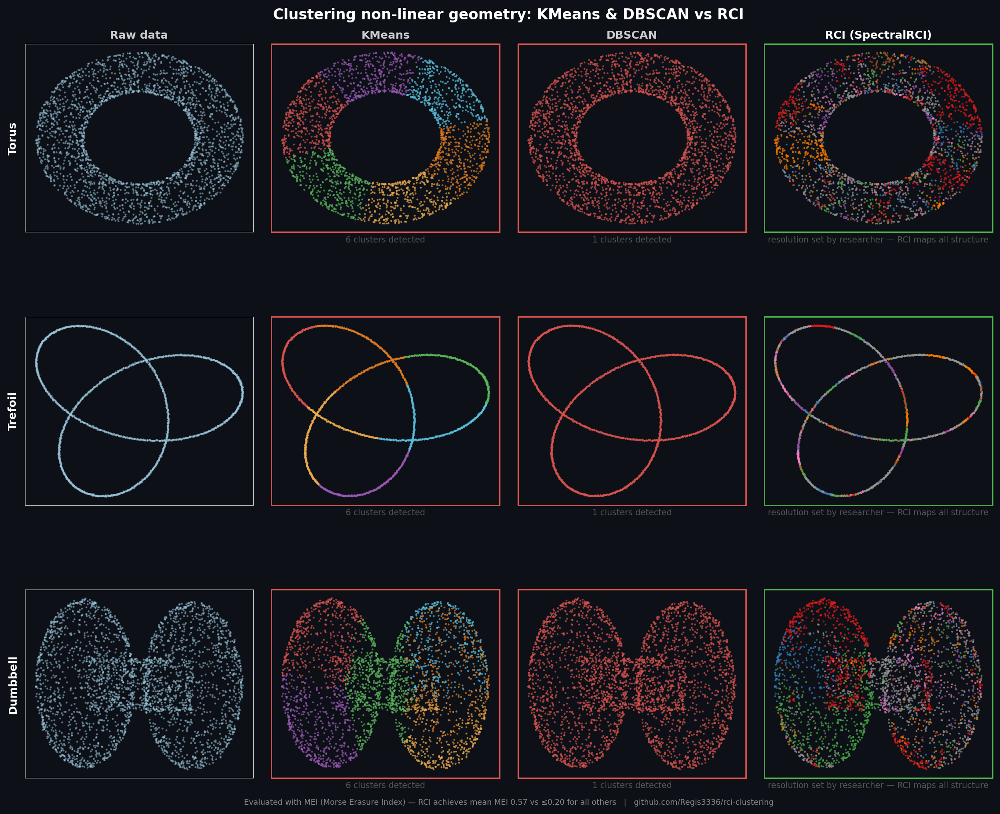
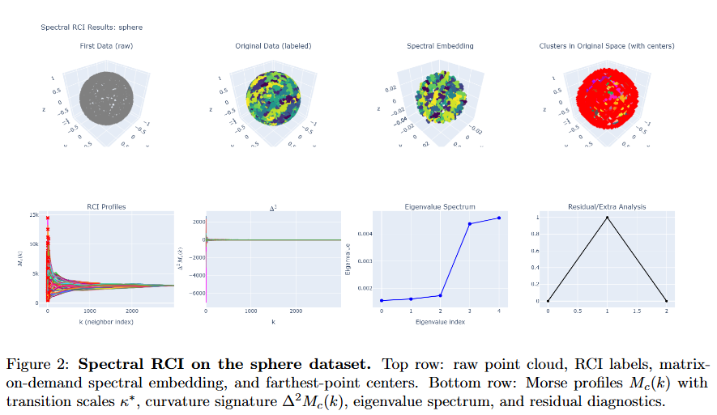
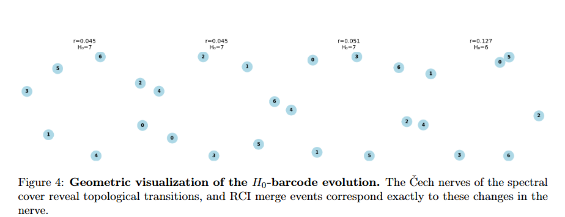

# RCI: Reverse Clustering Impact

[](https://opensource.org/licenses/MIT)
[](https://www.python.org/downloads/)
[](https://github.com/)
[](https://doi.org/10.5281/zenodo.20319851)

> **Official implementation of "Reverse Clustering Impact: Geometry-Driven Minimal Parameters for Clustering via Morse Theory"**

> KMeans slices a torus into wedges. DBSCAN fragments a trefoil.
> RCI extracts canonical metric cells and their homology.

<p align="center">
  
</p>

---

## 🚀 Run in 30 seconds

```bash
git clone https://github.com/Regis3336/rci-clustering.git
cd rci-clustering
pip install -r requirements.txt
python -m rci.core
```

→ Produces clustering + geometry diagnostics immediately

---

## 🧪 Minimal example

```python
from rci.core import SpectralRCI
from sklearn.datasets import make_moons

X, _ = make_moons(n_samples=500, noise=0.05)

model = SpectralRCI()
model.fit(X)
labels = model.predict()

print(labels[:10])
```

---

## 📖 What is RCI?

RCI generates canonical cells, canonical radii, and canonical homology. A nontrivial Čech nerve is not the primary output; Čech nerves appear only as scale-sections of the RCI nerve moduli during radial scale exploration.

Reverse Clustering Impact (RCI) is a metric radial procedure that transforms a finite metric space into locally calibrated canonical cells.

Each RCI cell is generated by an algorithmic center, a local radial Morse profile, a boundary index, and a canonical local radius \(r_j^\star\). The primary output is not merely a set of labels: it is a canonical cell system carrying intrinsic geometric and homological information.

RCI is not spectral clustering, density clustering, or graph clustering. Spectral embeddings and matrix-on-demand Laplacians are computational workspaces; the mathematical core is the metric radial construction.

At the canonical level, RCI outputs:

- canonical cells;
- canonical radii;
- a canonical partition / cell assignment;
- canonical homology.

A nontrivial Čech nerve is not a primary output. It appears only after radial scale exploration, when canonical cells are thickened or varied across scale. The resulting scale-indexed family of nerves is the **RCI nerve moduli**.

RCI generates its local canonical radii internally. A global scale parameter is used to navigate the moduli of gluings among the resulting cells.

---

## 🧠 Core ideas

**Canonical RCI Cells** — RCI does not merely assign labels. It constructs locally calibrated metric cells, each with an algorithmic center, a radial Morse profile, a boundary index, and a canonical radius \(r_j^\star\).

**Canonical Homology** — the canonical RCI output already carries homological information through its intrinsic cell system and local radii.

**Nerve Moduli** — RCI does not output a nontrivial Čech nerve at the primary level. Čech nerves appear only as scale-sections \(N(\lambda)\) of the RCI nerve moduli during radial scale exploration.

**Curvature Law** — cell boundaries are detected via the curvature-sensitive signature \(\Delta^2 M_c(k)\), which is negative on positively curved regions and positive on saddles.

**Matrix-on-Demand Spectral Engine** — the `MatrixOnDemandLaplacian` provides a scalable computational workspace without constructing dense \(N \times N\) matrices. It supports RCI but does not define it.

**Morse Erasure Index (MEI)** — a parameter-free intrinsic metric that quantifies how much of the Morse density field persists across cell boundaries.

---

## 📊 Benchmark results

RCI achieves the highest structural fidelity in **7 of 8 datasets**.

<table align="center">
  <thead>
    <tr>
      <th>Dataset</th><th>RCI</th><th>KMeans</th><th>DBSCAN</th><th>HDBSCAN</th><th>Spectral</th><th>GMM</th>
    </tr>
  </thead>
  <tbody>
    <tr><td>Sphere</td>     <td><b>0.70</b></td><td>0.12</td><td>0.56</td><td>0.44</td><td>0.10</td><td>0.13</td></tr>
    <tr><td>Saddle</td>     <td>0.03</td><td>0.06</td><td><b>0.52</b></td><td>0.41</td><td>0.07</td><td>0.07</td></tr>
    <tr><td>Torus</td>      <td><b>0.74</b></td><td>0.03</td><td>0.00</td><td>0.44</td><td>0.03</td><td>0.03</td></tr>
    <tr><td>Dumbbell</td>   <td><b>0.75</b></td><td>0.00</td><td>0.26</td><td>0.27</td><td>0.00</td><td>0.00</td></tr>
    <tr><td>Link</td>       <td><b>0.47</b></td><td>0.04</td><td>0.02</td><td>0.10</td><td>0.03</td><td>0.03</td></tr>
    <tr><td>Spiral</td>     <td><b>0.61</b></td><td>0.03</td><td>0.03</td><td>0.30</td><td>0.03</td><td>0.03</td></tr>
    <tr><td>Swiss Roll</td> <td><b>0.61</b></td><td>0.02</td><td>0.17</td><td>0.04</td><td>0.04</td><td>0.02</td></tr>
    <tr><td>Trefoil</td>    <td><b>0.68</b></td><td>0.03</td><td>0.05</td><td>0.37</td><td>0.03</td><td>0.03</td></tr>
  </tbody>
  <tfoot>
    <tr><td><b>Mean</b></td>   <td><b>0.57</b></td><td>0.04</td><td>0.20</td><td>0.30</td><td>0.04</td><td>0.04</td></tr>
    <tr><td><b>Std Dev</b></td><td>0.22</td><td>0.03</td><td>0.21</td><td>0.14</td><td>0.03</td><td>0.04</td></tr>
  </tfoot>
</table>

<p align="center">
  <em>MEI-based structural comparison. RCI achieves the highest mean (0.57), winning 7 of 8 datasets.</em>
</p>

Run the full benchmark suite:

```bash
python -m benchmarks.comparison_suite
```

---

## 🔬 Reproducibility & validation

### Spectral RCI pipeline

<p align="center">
  
</p>

Top: raw point cloud, RCI labels, spectral embedding, farthest-point centers.
Bottom: Morse profiles, curvature signature, eigenvalue spectrum, diagnostics.

---

### Structural homology validation (Appendix C)

`homology.py` validates the topological layer computationally:

- verifies canonical cell-to-homology behavior;
- constructs Čech nerves only as scale-sections of the RCI nerve moduli;
- checks the scale-poset sheaf consistency;
- matches dynamic homology and persistence with merge transitions.

```bash
python -m rci.homology
```

<p align="center">
  
</p>

---

## 📚 Theoretical foundation

📄 **Current version:** [theoretical_foundation/RCI_foundation_v2.pdf](theoretical_foundation/RCI_foundation_v2.pdf)

📦 **Archived version:** [theoretical_foundation/RCI_foundation_v1.pdf](theoretical_foundation/RCI_foundation_v1.pdf)

The repository keeps both versions for transparency.

- `RCI_foundation_v1.pdf` is the original mathematical foundation document.
- `RCI_foundation_v2.pdf` is the current revised foundation, introducing the updated formulation around canonical RCI cells, canonical radii, canonical homology, dynamic homology, and the RCI nerve moduli.

The current version includes:

- metric definition of RCI;
- canonical RCI cells and canonical radii;
- canonical homology;
- dynamic homology and RCI nerve moduli;
- Curvature Law;
- multi-scale Morse framework;
- farthest-point geometry;
- matrix-on-demand spectral workspace;
- MEI construction;
- robustness and stability proofs.

---

## 🧩 Implementation and theory

The code is a **computational instantiation** of the mathematical framework, not a heuristic approximation.

The `SpectralRCI` class name is historical: the reported benchmark configuration can run with `use_spectral=False`, and the formal RCI mechanism is metric. Spectral embeddings and matrix-on-demand Laplacians are computational workspaces used when appropriate.

The implementation validates the canonical cell system, canonical radii, MEI behavior, and the dynamic homology / nerve-moduli layer through reproducible scripts.

Related framework:

👉 https://github.com/Regis3336/operational-coherence

---

## 🧭 Roadmap

* **Graph-RCI** — extension to weighted graphs using spectral Laplacians
* **Hypergraph-RCI** — extension to higher-order incidence structures
* **Temporal-RCI (RCI-T)** — dynamic clustering with time-indexed Morse profiles

Full log: [CHANGELOG.md](CHANGELOG.md)

---

## 📂 Repository structure

```text
rci-clustering/
├── rci/
│   ├── core.py                  # Main metric RCI algorithm (canonical cells, radii, MatrixOnDemandLaplacian)
│   └── homology.py              # Validation of canonical homology, scale sheaf, nerve moduli, persistence
├── theoretical_foundation/
│   ├── RCI_foundation_v1.pdf    # Archived original foundation
│   └── RCI_foundation_v2.pdf    # Current revised mathematical framework
├── benchmarks/
│   └── comparison_suite.py      # Benchmark suite
├── generate_hero_image.py       # Generates images/hero_comparison.png
├── images/                      # Figures and documentation assets
├── results/                     # Scoreboard from the benchmark
└── CHANGELOG.md                 # Development log
```

---

## 📄 Citation

```bibtex
@misc{junior2025rci,
  title     = {Reverse Clustering Impact: Geometry-Driven Minimal Parameters for Clustering via Morse Theory},
  author    = {Junior, Reinaldo Elias de Souza},
  year      = {2026},
  publisher = {Zenodo},
  doi       = {10.5281/zenodo.20319868},
  url       = {https://doi.org/10.5281/zenodo.20319868}
}
```

---

## 📄 License

MIT License — see [LICENSE](LICENSE).
